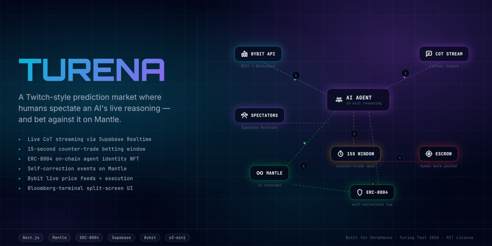

<div align="center">
  
  <h1>TURENA</h1>
  <h3>⚔️ The Turing Arena</h3>
  <p><em>Watch AI Trade. Bet Against It.</em></p>

  [](https://turena.edycu.dev)
  [](https://dorahacks.io/)
  [](https://youtube.com/)
  [](https://sepolia.mantlescan.xyz)
  <br><br>
  
  
  
  
  
  
  
</div>

---

## 🎯 What is Turena?

A live Twitch-style prediction market where a **DeepSeek R1** trading agent streams its raw Chain-of-Thought reasoning in real-time. You watch it think. You have **15 seconds** to bet against its decision. Every outcome — win, loss, and self-correction — is permanently recorded on **Mantle** via ERC-8004.

> **Live now:** [turena.edycu.dev](https://turena.edycu.dev) — the agent is running continuously on Mantle Sepolia.

---

## 🎬 How It Works

```
1. AI THINKS OUT LOUD
   DeepSeek R1 analyzes live Bybit market data.
   Every reasoning token streams to the terminal in real-time.
   "...order book shows whale accumulation... confidence 87%... initiating LONG..."

2. 15-SECOND COUNTER-TRADE WINDOW
   The AI announces its intent. A countdown opens.
   Connect MetaMask → click Counter-Trade → bet MNT against the AI.
   The bet is placed on-chain via CounterTradeEscrow.placeBet().

3. ON-CHAIN SETTLEMENT + SELF-CORRECTION
   Trade executes. Result recorded on Mantle via TuringAgent8004.recordTrade().
   If the AI loses → SelfCorrection event fires on-chain.
   Parameters adjust. NFT metadata updates. UI flashes the correction live.
```

---

## 📜 Smart Contracts (Mantle Sepolia)

Both contracts deployed and **source-verified** on Mantle Sepolia (Chain ID `5003`).

| Contract | Address | Explorer | Verified Source |
|---|---|---|---|
| `TuringAgent8004` | `0x3f24Bc75B258d35a347C4A76d49F45020A3457ce` | [Mantlescan ↗](https://sepolia.mantlescan.xyz/address/0x3f24Bc75B258d35a347C4A76d49F45020A3457ce) | [Sourcify ✅](https://repo.sourcify.dev/contracts/full_match/5003/0x3f24Bc75B258d35a347C4A76d49F45020A3457ce/) |
| `CounterTradeEscrow` | `0x766F2485219D5977AE727E6B1738891310EC8f3d` | [Mantlescan ↗](https://sepolia.mantlescan.xyz/address/0x766F2485219D5977AE727E6B1738891310EC8f3d) | [Sourcify ✅](https://repo.sourcify.dev/contracts/full_match/5003/0x766F2485219D5977AE727E6B1738891310EC8f3d/) |

**On-chain proof of live activity (verifiable by judges):**

| Event | Tx Hash | What it proves |
|---|---|---|
| `SelfCorrection` fired | [`0x13cc6958…`](https://sepolia.mantlescan.xyz/tx/0x13cc6958f0d66e7f52aba0ccc4fe1aeaffc8c56e1bf6f1e0cfc28f50cd9c70be) | AI adjusted `confidence_threshold` 0.7 → 0.75 on-chain |
| `placeBet` (human) | [`0x3d37eed3…`](https://sepolia.mantlescan.xyz/tx/0x3d37eed32f926c410b2fcda68019ca88c68d68a8b0488adbdecbbd09e5e0bc26) | Real human bet placed against AI during live session |
| 30+ `recordTrade` txs | [TuringAgent history ↗](https://sepolia.mantlescan.xyz/address/0x3f24Bc75B258d35a347C4A76d49F45020A3457ce) | Continuous autonomous trading on Mantle Sepolia |

---

## 💡 The Problem & Solution

On-chain AI agents are black boxes. You send them capital, they trade, you pray. The promise of "transparent AI" in crypto has been reduced to JSON logs that no human can parse in real-time.

**Turena** forces the AI to think out loud — every hesitation, every calculation — streamed live before the trade executes. The 15-second window gives humans a genuine economic edge against the AI, creating the first **Human vs. AI prediction market** on Mantle.

**Key Features:**
- ⚡ **AI Thinks Out Loud** — DeepSeek R1's `reasoning_content` tokens stream character-by-character in a hacker terminal UI
- ⏱️ **15-Second Counter Window** — Bet MNT against the AI's position before it executes
- 🔒 **Immutable On-Chain Record** — Every trade and self-correction recorded via ERC-8004 on Mantle
- 🧠 **Live Self-Correction** — AI adjusts its own risk parameters on-chain when it loses; full-screen overlay shows exactly what changed

---

## 🏗️ Architecture & Tech Stack

| Layer | Choice | Why |
|-------|--------|-----|
| **Frontend** | Next.js 16 (App Router), React 19 | SSR landing page, client components for real-time arena UI |
| **Styling** | Tailwind CSS v4 | Dark mode, responsive, fast iteration |
| **Real-time** | Supabase Realtime (`postgres_changes`) | WebSocket push for CoT tokens, bets, corrections — zero infra |
| **Database** | Supabase PostgreSQL | 5 tables: `trade_cycles`, `cot_tokens`, `counter_trades`, `self_corrections`, `agent_state` |
| **AI Backend** | Python FastAPI + DeepSeek R1 | `deepseek-reasoner` is the only model exposing raw `reasoning_content` via SSE |
| **Market Data** | Bybit Testnet + CoinGecko fallback | Paper trading prevents real-money execution; CoinGecko covers region blocks |
| **Smart Contracts** | Solidity 0.8.24, Hardhat, OpenZeppelin v5 | ERC-8004 identity NFT + bankroll-backed escrow |
| **Chain** | Mantle Sepolia (5003) | Fast finality for 15-second settlement windows |
| **Deploy** | Vercel (frontend) + Railway (backend) | Global edge, auto-deploy on push |

### Data Flow


> Full diagram → [docs/ARCHITECTURE.md](docs/ARCHITECTURE.md) · API → [docs/API.md](docs/API.md) · Contracts → [docs/CONTRACTS.md](docs/CONTRACTS.md) · Schema → [docs/DATABASE.md](docs/DATABASE.md)

---

## 🔐 Why Mantle + ERC-8004 is Non-Replaceable

> *"Could you swap Mantle out for a database?"* — **No.**

1. **`recordTrade()`** — Immutable on-chain event. A DB record can be edited; a Mantle tx cannot.
2. **`recordSelfCorrection()`** — `SelfCorrection` log on Mantle Explorer is public *before* the next trade executes.
3. **Dynamic NFT** — ERC-8004 metadata updates after each cycle. Agent ELO, win rate, strategy readable on-chain.
4. **`settle()`** — Escrow settlement is on-chain. No server controls the payout.
5. **`bankroll`** — Publicly readable. Bettors verify solvency before placing a bet.

Remove Mantle and you need: a trusted settlement server + mutable audit DB + separate payout system + a trust model. The entire transparency claim collapses.

---

## 🏆 Tracks Targeted

1. **Mantle Network** — `TuringAgent8004` + `CounterTradeEscrow` on Mantle Sepolia; fast finality enables real-time 15-second settlement
2. **AI Trading & Strategy (BGA)** — Autonomous quant agent with live Bybit integration and on-chain parameter tuning
3. **Consumer & Viral DApps** — Twitch-style spectator UI; 15-second counter-trade windows create clip-worthy Human vs. AI moments

---

## 🚀 Run Locally (For Judges)

### Prerequisites
- Node.js 20+, Python 3.12+
- MetaMask with Mantle Sepolia configured (see below)
- Testnet MNT from [faucet.sepolia.mantle.xyz](https://faucet.sepolia.mantle.xyz)

### Add Mantle Sepolia to MetaMask

> Do **not** use the built-in "Testnet Mantle" — it's the deprecated network. Add manually:

| Field | Value |
|---|---|
| Network name | `Mantle Sepolia Testnet` |
| RPC URL | `https://rpc.sepolia.mantle.xyz` |
| Chain ID | `5003` |
| Currency symbol | `MNT` |
| Block explorer | `https://sepolia.mantlescan.xyz` |

### 1. Frontend
```bash
npm install
cp .env.example .env.local
# Fill: NEXT_PUBLIC_SUPABASE_URL, NEXT_PUBLIC_SUPABASE_ANON_KEY
#       NEXT_PUBLIC_TURING_AGENT_ADDRESS, NEXT_PUBLIC_ESCROW_ADDRESS
#       SUPABASE_SERVICE_ROLE_KEY
#       BACKEND_URL=http://localhost:8000
#       NEXT_PUBLIC_BACKEND_URL=http://localhost:8000
npm run dev
```

### 2. Backend
```bash
cd backend
cp .env.example .env
# Fill: DEEPSEEK_API_KEY, BYBIT_API_KEY, BYBIT_API_SECRET
#       SUPABASE_URL, SUPABASE_DB_PASSWORD
#       DEPLOYER_PRIVATE_KEY, TURING_AGENT_ADDRESS, ESCROW_ADDRESS
pip install -r requirements.txt
AUTO_CYCLE=true uvicorn main:app --reload
```

### 3. Contracts (already deployed — only if redeploying)
```bash
cd contracts
npm install
npx hardhat run scripts/deploy.ts --network mantleTestnet
```

### 4. Trigger a cycle manually (demo)
```bash
curl -X POST https://turena-production.up.railway.app/agent/run-cycle
# Then open /arena and click [dev] open counter window to place a bet
```

---

## 🛠️ Environment Variables

**Vercel (Frontend)**

| Variable | Description |
|---|---|
| `NEXT_PUBLIC_SUPABASE_URL` | Supabase project URL |
| `NEXT_PUBLIC_SUPABASE_ANON_KEY` | Supabase anon key — safe for browser |
| `NEXT_PUBLIC_TURING_AGENT_ADDRESS` | `0x3f24Bc75B258d35a347C4A76d49F45020A3457ce` |
| `NEXT_PUBLIC_ESCROW_ADDRESS` | `0x766F2485219D5977AE727E6B1738891310EC8f3d` |
| `NEXT_PUBLIC_BACKEND_URL` | Railway URL — client-side cycle trigger |
| `SUPABASE_SERVICE_ROLE_KEY` | Server-side only, never exposed to browser |
| `BACKEND_URL` | Railway URL — server-side price proxy |
| `DEMO_MODE` | `true` enables `/agent/mock-outcome`. **Never `true` in production** |

**Railway (Backend)**

| Variable | Description |
|---|---|
| `SUPABASE_URL` | Supabase project URL |
| `SUPABASE_DB_PASSWORD` | DB password (not the JWT key) — from Supabase → Settings → Database |
| `SUPABASE_POOLER_HOST` | Transaction pooler host — defaults to `aws-1-ap-southeast-2.pooler.supabase.com` |
| `DEEPSEEK_API_KEY` | DeepSeek API key |
| `BYBIT_API_KEY` / `BYBIT_API_SECRET` | Bybit testnet credentials |
| `DEPLOYER_PRIVATE_KEY` | Mantle deployer wallet private key |
| `TURING_AGENT_ADDRESS` / `ESCROW_ADDRESS` | Deployed contract addresses |
| `AUTO_CYCLE` | `true` runs trade cycles continuously on boot |
| `DEMO_MODE` | `true` enables `/agent/mock-outcome`. **Never `true` in production** |

---

## 🤝 Sponsors & Partners

**Co-Sponsored by:** Tencent Cloud, ELFA, Surf, Orbit AI, Minds, Mirana, OpenCheck, Nansen

**Community Partners:** BU, OT, Decipher, Imperial Blockchain & Fintech, Cornell Blockchain, MU Shanghai, Z.AI, Orakle, HKUST Crypto-Fintech Lab, Akindo, KudasaiJP, Rocketpunch, TradeGainTT, Four Pillars, Blockchain Valley, Zhejiang University, Merchant Moe

**Co-Supported by:** DoraHacks, HackQuest

---

## 📄 License

MIT
