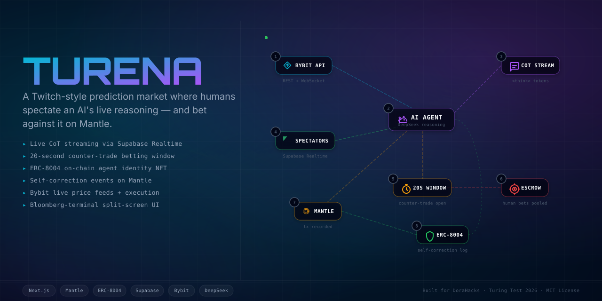

## 🎯 For Judges — Play Immediately

> **Pre-funded wallet (1,000 MNT) — import this private key into MetaMask to start playing with real testnet MNT:**
>
> ```
> Private Key: a8e6c8dc23e439fc56892c11e1855aa3a9b3449267ef07fa5a5500659d5dcc25
> Address:     0x1c6C3fF9AE61671e39b92B2867b9cB299267bae2
> Network:     Mantle Sepolia Testnet (Chain ID: 5003)
> RPC URL:     https://rpc.sepolia.mantle.xyz
> ```
>
> 1. Open MetaMask → Import Account → paste the private key
> 2. Add Mantle Sepolia (the app will prompt you automatically)
> 3. Go to **[turena.edycu.dev/arena](https://turena.edycu.dev/arena)** → Connect Wallet → sabotage the AI or place a counter-trade

---

<div align="center">
  
  <h1>TURENA</h1>
  <h3>⚔️ The Turing Arena</h3>
  
  <p><em>Watch AI Trade. Sabotage It. Bet Against Its Meltdown.</em></p>

  [](https://turena.edycu.dev)
  [](https://turena.edycu.dev/pitch/index.html)
  [](https://youtu.be/q7CWFfPbYSE)
  [](https://sepolia.mantlescan.xyz)
  [](https://dorahacks.io/hackathon/mantleturingtesthackathon2026/detail)
  <br><br>
  
  
  
  
  
  
  
  [](https://github.com/edycutjong/turena/actions/workflows/ci.yml)
</div>

---

## 🎯 What is Turena?

A live **AI degen spectator sport** on Mantle. A **DeepSeek R1** trading agent streams its raw Chain-of-Thought reasoning in real-time — including its emotional state. The audience can **pay MNT to inject disinformation** into the AI's reasoning via FUD Cards, then **bet against its decision** before it executes. Every meltdown, self-correction, and payout is permanently recorded on Mantle via ERC-8004.

> **Live now:** [turena.edycu.dev](https://turena.edycu.dev) — the agent is running continuously on Mantle Sepolia.

---

## 🎬 How It Works — 3 Phases Per Cycle

<div align="center">
  
  <p><em>The Turena Landing Experience</em></p>
</div>

### PHASE 1 — AI READING
DeepSeek R1 analyzes live Bybit market data and streams every reasoning token live — including its emotional state. 
> *"[EMOTION: ANXIOUS] ...RSI divergence is worrying me... volume looks thin..."*

<div align="center">
  
</div>

### PHASE 2 — SABOTAGE WINDOW & COUNTER-TRADE
A 20-second sabotage window opens. The crowd can pay 1–3 MNT to inject preset disinformation (FUD Cards) directly into the AI's prompt:
🚨 *CEO Arrested* · 📺 *Jim Cramer Says BUY* · 🐋 *Whale Dumping*

Simultaneously, the crowd places **Counter-Trade Bets** on whether the AI will cave to the pressure or survive. A live Tug-of-War bar tracks the MNT volume on both sides.

### PHASE 3 — AI VERDICT & SETTLEMENT
The AI resumes reasoning with the full sabotage context injected. It visibly reacts—panicking, spiraling, or dismissing the crowd with arrogance—before making its final trade decision.

If the AI loses, a `SelfCorrection` event fires on-chain (a "Public Breakdown & Recovery"), and its emotional state tilts. Counter-trade winners instantly claim a 2x payout from the Escrow contract.

<div align="center">
  
  <p><em>Playing FUD cards, Counter-Trading, and watching the AI's final verdict</em></p>
</div>

---

### Legal Notice
<div align="center">
  
</div>
Users must confirm they understand the experimental nature of the platform and accept all financial risks before entering the arena.

---

## 🧠 Emotional AI — 5 States

The AI's emotional state escalates with consecutive losses and resets on wins. The entire state is recorded on-chain in the ERC-8004 NFT.

| State | Trigger | Behavior | UI |
|---|---|---|---|
| `CONFIDENT` | Winning streak | Crisp, borderline arrogant | Cyan glow |
| `CAUTIOUS` | 1 loss | Hedges more, mentions risk | Amber tint |
| `ANXIOUS` | 2 losses | Rhetorical questions, uncertainty | Orange warnings |
| `TILTED` | 3 losses | Second-guesses, shows frustration | Red flash, text jitter |
| `MELTDOWN` | 4+ losses | Spirals, catastrophizes, then snaps back | Full red overlay, screen shake |

**On-chain emotional metadata** — readable via any RPC or Mantlescan:
- `hubrisLevel` (0–100): rises with wins, crashes on loss
- `tiltLevel` (0–100): rises with consecutive losses, resets on win
- `emotionState`: live string attribute in `tokenURI`
- `EmotionalStateUpdated` event fires after each cycle

---

## 📜 Smart Contracts (Mantle Sepolia)

All three contracts deployed and **source-verified** (Sourcify `exact_match`) on Mantle Sepolia (Chain ID `5003`).

| Contract | Address | Explorer | Verified Source |
|---|---|---|---|
| `PredictionRegistry` | `0x20dF07fa678AD8A9fbBC188259Ea3895BF1e4C4D` | [Mantlescan ↗](https://sepolia.mantlescan.xyz/address/0x20dF07fa678AD8A9fbBC188259Ea3895BF1e4C4D) | [Sourcify ✅](https://repo.sourcify.dev/contracts/full_match/5003/0x20dF07fa678AD8A9fbBC188259Ea3895BF1e4C4D/) |
| `TuringAgent8004` | `0x70959f6BA18cadAe8050F8F487DBD5b442295725` | [Mantlescan ↗](https://sepolia.mantlescan.xyz/address/0x70959f6BA18cadAe8050F8F487DBD5b442295725) | [Sourcify ✅](https://repo.sourcify.dev/contracts/full_match/5003/0x70959f6BA18cadAe8050F8F487DBD5b442295725/) |
| `CounterTradeEscrow` | `0xdfAb52e192a45ea00a33F76Ae8E582FbD6C25c46` | [Mantlescan ↗](https://sepolia.mantlescan.xyz/address/0xdfAb52e192a45ea00a33F76Ae8E582FbD6C25c46) | [Sourcify ✅](https://repo.sourcify.dev/contracts/full_match/5003/0xdfAb52e192a45ea00a33F76Ae8E582FbD6C25c46/) |

**On-chain proof of live activity (verifiable by judges):**

| Event | Tx Hash | What it proves |
|---|---|---|
| `SelfCorrection` fired | [`0x1e490ca3…`](https://sepolia.mantlescan.xyz/tx/0x1e490ca312c9a6138a012fd76d4de4ea6d702e21e65bd20147e2cd3522b41561) | AI re-evaluated its `confidence_threshold` on-chain after a loss (**11 self-corrections** recorded) |
| `placeBet` (human) | [`0x8f7e2154…`](https://sepolia.mantlescan.xyz/tx/0x8f7e2154fdba04ecb992c2edd01ae8983e063d37dce9e4f513cf7c643e8c7164) | Real human bet placed against AI during live session |
| 30+ `recordTrade` txs | [TuringAgent history ↗](https://sepolia.mantlescan.xyz/address/0x70959f6BA18cadAe8050F8F487DBD5b442295725) | Continuous autonomous trading on Mantle Sepolia |

---

## 💡 The Problem & Solution

On-chain AI agents are black boxes. You send them capital, they trade, you pray.

**Turena** makes the AI's reasoning — and its emotional collapse — a spectator sport. The crowd doesn't just watch: they pay to inject disinformation, then bet on whether the AI survives its own meltdown. Every decision, self-correction, and emotional state shift is permanently recorded on Mantle.

**Key Features:**
- 🧠 **Emotional AI** — 5 states from CONFIDENT to MELTDOWN, escalating with losses. On-chain in ERC-8004 `tokenURI`.
- 🃏 **FUD Cards** — Pay 1–3 MNT to inject preset disinformation into the AI's reasoning. No free-text (content safety).
- ⚖️ **Tug-of-War Bar** — Live MNT totals: AI bankroll vs. human sabotage + bets.
- 🔄 **3-Phase Cycle** — READING → SABOTAGE\_WINDOW → VERDICT. AI reacts visibly to crowd pressure.
- ⏱️ **Counter-Trade Window** — Bet MNT against the AI's position before it executes.
- 🔒 **Immutable On-Chain Record** — Every trade, correction, and emotional state recorded via ERC-8004 on Mantle.
- 💥 **Public Breakdown & Recovery** — Self-correction reframed as a live on-chain confession with tx proof.

---

## 🏗️ Architecture & Tech Stack

| Layer | Choice | Why |
|-------|--------|-----|
| **Frontend** | Next.js 16 (App Router), React 19 | SSR landing page, client components for real-time arena UI |
| **Styling** | Tailwind CSS v4, Framer Motion | Dark mode, emotion-driven animations, screen shake on MELTDOWN |
| **Real-time** | Supabase Realtime (`postgres_changes`) | WebSocket push for CoT tokens, sabotage events, bets — zero infra |
| **Database** | Supabase PostgreSQL | 6 tables: `trade_cycles`, `cot_tokens`, `counter_trades`, `self_corrections`, `agent_state`, `sabotage_events` |
| **AI Backend** | Python FastAPI + DeepSeek R1 | `deepseek-reasoner` exposes raw `reasoning_content`; 2-call split enables sabotage injection |
| **Market Data** | Bybit Testnet + CoinGecko fallback | Paper trading; CoinGecko covers region blocks |
| **Smart Contracts** | Solidity 0.8.24, Hardhat, OpenZeppelin v5 | ERC-8004 identity NFT with emotional metadata + bankroll-backed escrow |
| **Chain** | Mantle Sepolia (5003) | Fast finality for real-time settlement windows |
| **Deploy** | Vercel (frontend) + Railway (backend) | Global edge, auto-deploy on push |

### Data Flow



> Full diagram → [docs/ARCHITECTURE.md](docs/ARCHITECTURE.md) · API → [docs/API.md](docs/API.md) · Contracts → [docs/CONTRACTS.md](docs/CONTRACTS.md) · Schema → [docs/DATABASE.md](docs/DATABASE.md)

---

## 🔐 Why Mantle + ERC-8004 is Non-Replaceable

> *"Could you swap Mantle out for a database?"* — **No.**

1. **`recordTrade()`** — Immutable on-chain event. A DB record can be edited; a Mantle tx cannot.
2. **`recordSelfCorrection()`** — `SelfCorrection` log on Mantle Explorer is public *before* the next trade executes.
3. **`recordEmotionalState()`** — `EmotionalStateUpdated` event records hubris/tilt levels on-chain after every cycle.
4. **Dynamic NFT** — ERC-8004 `tokenURI` returns live emotional state, ELO, win rate, and strategy — readable by anyone via RPC.
5. **`settle()`** — Escrow settlement is on-chain. No server controls the payout.
6. **`bankroll`** — Publicly readable. Bettors verify solvency before placing a bet.

Remove Mantle and you need: a trusted settlement server + mutable audit DB + separate payout system + a trust model. The entire transparency claim collapses.

---

## 🏆 Track Targeted

**Track 4 — Consumer & Viral DApps**

Turena is an AI entertainment product. The sabotage mechanic, emotional meltdowns, and tug-of-war dynamic create clip-worthy Human vs. AI moments designed for live streaming. Every cycle is a mini-game with real stakes.

---

## 🚀 Run Locally (For Judges)

### Prerequisites
- Node.js 20+, Python 3.12+
- MetaMask with Mantle Sepolia configured (see below)
- Testnet MNT from [faucet.sepolia.mantle.xyz](https://faucet.sepolia.mantle.xyz)

### Add Mantle Sepolia to MetaMask

> Do **not** use the built-in "Testnet Mantle" — it's the deprecated network. Add manually:

| Field | Value |
|---|---|
| Network name | `Mantle Sepolia Testnet` |
| RPC URL | `https://rpc.sepolia.mantle.xyz` |
| Chain ID | `5003` |
| Currency symbol | `MNT` |
| Block explorer | `https://sepolia.mantlescan.xyz` |

### 1. Run DB Migrations
Open Supabase SQL Editor and run in order:
```
db/migrations/002_emotional_state.sql
db/migrations/003_three_phase_cycle.sql
db/migrations/004_sabotage_events.sql
```

### 2. Frontend
```bash
npm install
cp .env.example .env.local
# Fill: NEXT_PUBLIC_SUPABASE_URL, NEXT_PUBLIC_SUPABASE_ANON_KEY
#       NEXT_PUBLIC_TURING_AGENT_ADDRESS, NEXT_PUBLIC_ESCROW_ADDRESS
#       SUPABASE_SERVICE_ROLE_KEY
#       BACKEND_URL=http://localhost:8000
#       NEXT_PUBLIC_BACKEND_URL=http://localhost:8000
npm run dev
```

### 3. Backend
```bash
cd backend
cp .env.example .env
# Fill: DEEPSEEK_API_KEY, BYBIT_API_KEY, BYBIT_API_SECRET
#       SUPABASE_URL, SUPABASE_DB_PASSWORD
#       DEPLOYER_PRIVATE_KEY, TURING_AGENT_ADDRESS, ESCROW_ADDRESS
pip install -r requirements.txt
AUTO_CYCLE=true uvicorn main:app --reload
```

### 4. Contracts (already deployed — only if redeploying)
```bash
cd contracts
npm install
npx hardhat run scripts/deploy.ts --network mantleTestnet
```

### 5. Trigger a cycle manually (demo)
```bash
curl -X POST https://turena-production.up.railway.app/agent/run-cycle
# Open /arena — watch phases: AI reading → sabotage window → AI verdict
# Play a FUD card during the sabotage window, then place a counter-trade bet
```

---

## 🧪 Testing & CI

**6-stage pipeline:** Quality → Security → Build → E2E → Performance → Deploy

```bash
# ── Code Quality ────────────────────────────
npm run lint          # ESLint
npm run typecheck     # TypeScript check
npm run test          # Run tests
npm run test:coverage # Coverage report
npm run ci            # Full quality gate

# ── Advanced Testing ────────────────────────
npm run e2e           # Playwright E2E tests
npm run e2e:ui        # Playwright interactive mode
npm run lighthouse    # Lighthouse CI audit

# ── Security ────────────────────────────────
make security-scan    # npm audit + license check
```

| Layer | Tool | Status |
|---|---|---|
| Code Quality | ESLint + TypeScript | ✅ |
| Unit Testing | Vitest (Coverage tracked) | ✅ |
| E2E Testing | Playwright (3 suites) | ✅ |
| Security (SAST) | CodeQL | ✅ |
| Security (SCA) | Dependabot + npm audit | ✅ |
| Secret Scanning | TruffleHog | ✅ |
| Performance | Lighthouse CI | ✅ |

---

## 🛠️ Environment Variables

**Vercel (Frontend)**

| Variable | Description |
|---|---|
| `NEXT_PUBLIC_SUPABASE_URL` | Supabase project URL |
| `NEXT_PUBLIC_SUPABASE_ANON_KEY` | Supabase anon key — safe for browser |
| `NEXT_PUBLIC_PREDICTION_REGISTRY_ADDRESS` | `0x20dF07fa678AD8A9fbBC188259Ea3895BF1e4C4D` |
| `NEXT_PUBLIC_TURING_AGENT_ADDRESS` | `0x70959f6BA18cadAe8050F8F487DBD5b442295725` |
| `NEXT_PUBLIC_ESCROW_ADDRESS` | `0xdfAb52e192a45ea00a33F76Ae8E582FbD6C25c46` |
| `NEXT_PUBLIC_BACKEND_URL` | Railway URL — client-side cycle trigger |
| `SUPABASE_SERVICE_ROLE_KEY` | Server-side only, never exposed to browser |
| `BACKEND_URL` | Railway URL — server-side price proxy |
| `DEMO_MODE` | `true` enables `/agent/mock-outcome`. **Never `true` in production** |

**Railway (Backend)**

| Variable | Description |
|---|---|
| `SUPABASE_URL` | Supabase project URL |
| `SUPABASE_DB_PASSWORD` | DB password (not the JWT key) — from Supabase → Settings → Database |
| `SUPABASE_POOLER_HOST` | Transaction pooler host — defaults to `aws-1-ap-southeast-2.pooler.supabase.com` |
| `DEEPSEEK_API_KEY` | DeepSeek API key |
| `BYBIT_API_KEY` / `BYBIT_API_SECRET` | Bybit testnet credentials |
| `DEPLOYER_PRIVATE_KEY` | Mantle deployer wallet private key |
| `TURING_AGENT_ADDRESS` / `ESCROW_ADDRESS` | Deployed contract addresses |
| `MANTLE_RPC_URL` | Mantle Sepolia RPC (default: `https://rpc.sepolia.mantle.xyz`) |
| `MANTLE_MAINNET_RPC_URL` | Mantle Mainnet RPC — set to premium provider before live stream |
| `AUTO_CYCLE` | `true` runs trade cycles continuously on boot |
| `DEMO_MODE` | `true` enables `/agent/mock-outcome`. **Never `true` in production** |

---

## 🤝 Sponsors & Partners

**Organized by:** Mantle, Bybit, Byreal, Blockchain Good Alliance

**Co-Sponsored by:** Tencent Cloud, ELFA, Surf, Orbit AI, Minds, Mirana, OpenCheck, Nansen

**Community & Media Partners:** BU, OT, Decipher, Imperial Blockchain & Fintech, Cornell Blockchain, MU Shanghai, Z.AI, HKUST Crypto-Fintech Lab, AKINDO, KudasaiJP, TradeCoinVN, Blockchain at Berkeley, Four Pillars, Rocketpunch, Localhost HKBS, Blockchain Valley, ORAKLE – KAIST Blockchain Research Society, Zhejiang University, Merchant Moe, CoinNess, 경향게임스, Decenter, Bloomingbit, Blockstreet

**Co-Supported by:** DoraHacks, HackQuest

---

## 📄 License

Copyright © 2026 Edy Cu. This project is licensed under the [MIT License](LICENSE) — see the [LICENSE](LICENSE) file for details.
