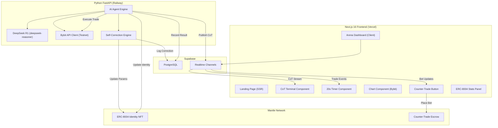

# Turena — Architecture

## System Diagram

## Deployment Architecture

## Supabase Realtime Streaming Pattern

Python does **not** push directly to Supabase Realtime channels — the Python client's broadcast support is unreliable at high token frequency. Instead:

1. Python inserts each CoT token as a row into `cot_tokens` table (simple `INSERT`)
2. Supabase Realtime's `postgres_changes` event fires on every insert and broadcasts to all subscribers
3. Next.js frontend subscribes to `postgres_changes` on `cot_tokens` — receives every token automatically

This pattern is simpler, more reliable, and gives a free persistent log of every token streamed. No broadcast client config needed.

### Event Reference

| Source | Mechanism | Payload |
|--------|-----------|---------|
| CoT token | `postgres_changes` on `cot_tokens INSERT` | `{token_text, token_type, cycle_id}` |
| Trade intent | `cot_tokens` where `token_type='intent'` | `{action, asset, confidence}` |
| Cycle start | `trade_cycles INSERT` | `{id, cycle_number, created_at}` |
| Sabotage window | `trade_cycles UPDATE` | `{sabotage_started_at}` |
| FUD played | `sabotage_events INSERT` | `{card_type, prompt_injection, mnt_paid}` |
| Trade executed | `trade_cycles UPDATE` | `{result, tx_hash, pnl_mnt}` |
| Self-correction | `self_corrections INSERT` | `{parameter_changed, old_value, new_value, regret_score}` |
| Bet placed | `counter_trades INSERT` | `{wallet_address, amount_mnt, position}` |
| Bet settled | `counter_trades UPDATE` | `{result, payout_mnt}` |

## Key Libraries

| Library | Purpose |
|---------|---------|
| `@supabase/supabase-js` | Database + Realtime `postgres_changes` subscriptions |
| `recharts` | Market chart visualization |
| `framer-motion` | Timer animations, pulse effects, transitions |
| `viem` | Mantle contract interaction (lightweight) |
| `openai` (Python) | DeepSeek R1 API — OpenAI-compatible, `model="deepseek-reasoner"` |
| `ccxt` (Python) | Bybit API wrapper — `testnet=True` by default |
| `fastapi` + `uvicorn` | Python backend server |
| `asyncpg` (Python) | Direct Postgres for high-frequency `cot_tokens` inserts |
| `hardhat` | Smart contract development + deployment |

## Real Integration Guarantee

> Lesson from prior hackathons: shipping `MOCK=true` as default lost two previous entries to judges who cloned the repo. Every integration in this project is wired to real endpoints.

| Integration | Real or Mocked? | Default |
|-------------|----------------|---------|
| DeepSeek R1 API | **Real** | Always on |
| Bybit market data | **Real** | Always on (testnet) |
| Bybit trade execution | Real (Testnet) | `BYBIT_TESTNET=true` |
| Supabase PostgreSQL | **Real** | Always on |
| Supabase Realtime (`postgres_changes`) | **Real** | Always on |
| Mantle contract calls | Real (Testnet) | Always on after deployment |
| `/agent/mock-outcome` | Artificial outcome injection | `DEMO_MODE=false` in prod |

The `/agent/mock-outcome` endpoint is **not a mock integration** — it uses real Supabase writes and real Mantle contract calls. It only forces the trade *result* to `loss` so the demo video can guarantee a self-correction event within 3 minutes.
